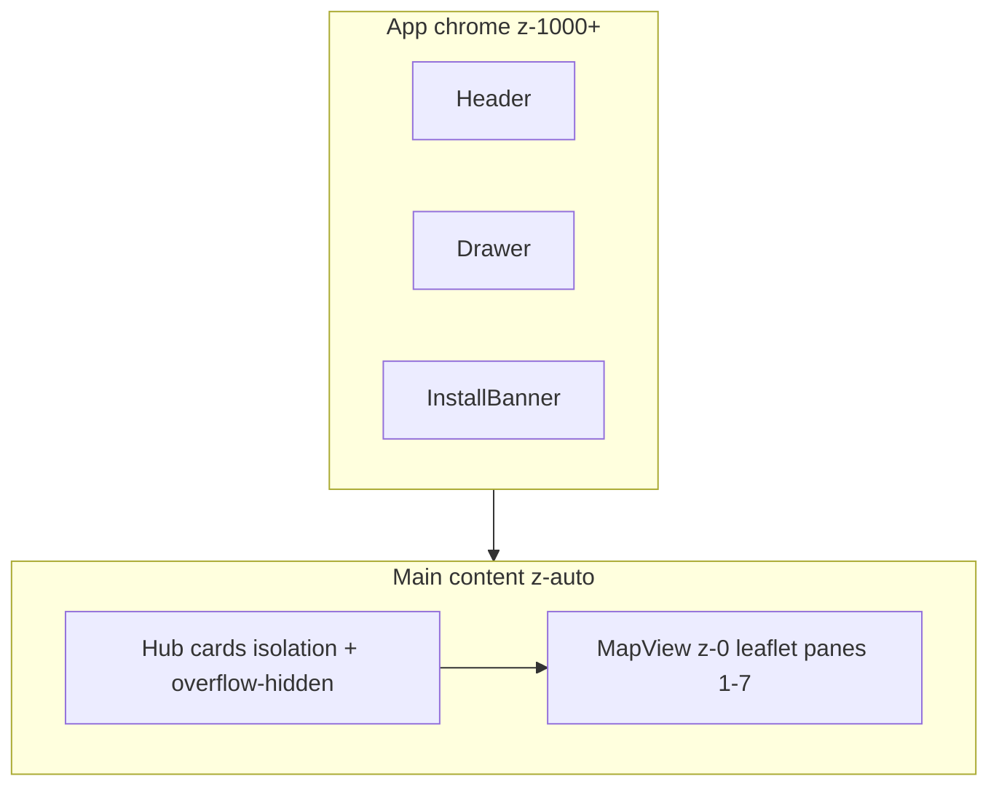

# fix: Hub map stacking, hub parity, sismos archipelago, map defaults

## Summary

Fix Leaflet maps painting above app chrome (sidebar, install banner), align the hub with the Expo mobile home screen (preview cards only — no personalization grid), show the full Azores archipelago on hub sismos preview with event dots, default earthquakes and traffic pages to map view (and show map even when empty), and update `hubSubtitle` copy now that personalization is disabled.

## Problem Frame

- Hub mini-maps use Leaflet panes (~200–1000 z-index) that escape their card containers and paint over the mobile drawer (`z-50`) and install banner (`z-60`).
- Hub layout diverges from the mobile hub: broken grid nesting, wrong locale keys, and a prepare hero section that bloats the home screen; personalization copy is stale.
- Hub sismos preview fits to São Miguel event bounds (`zoom=9`) instead of the full archipelago.
- `EarthquakesPage` defaults to list and shows `EmptyState` when there are zero events even if the user selected Map — map never appears.
- `TrafficPage` defaults to list; product wants map as default for both map/list modules.
- `hubSubtitle` references pinning favourites; personalization is disabled.

## Requirements

| ID | Requirement |
|----|-------------|
| R1 | Maps must never render above sidebar, header, language picker, or install banner anywhere in the app |
| R2 | Hub shows only mobile-parity preview cards: bus CTA, weather, sismos, traffic, news (no module grid, no pin UI, no prepare hero section) |
| R3 | Hub sismos mini-map frames the full Azores archipelago and plots magnitude-coloured dots for events in the last 24h |
| R4 | Earthquakes page defaults to map; map tab shows archipelago map even when the event list is empty |
| R5 | Traffic page defaults to map |
| R6 | `hubSubtitle` no longer mentions pinning or personalization |

## Key Technical Decisions

1. **Cap Leaflet z-index in global CSS** — lower all `.leaflet-pane` values to 1–7 inside `.leaflet-container` (`z-index: 0`) so maps stay within their stacking context; raise shell overlays to `z-[1000+]` as a belt-and-suspenders fix. Rationale: matches legacy `z-0` pattern, avoids per-page patches.
2. **Shared archipelago view constant** — add `src/lib/map-bounds.ts` with `AZORES_ARCHIPELAGO_VIEW` (`center`, `zoom: 7`, `fit: false`) reused by hub mini-map, earthquakes empty map, and earthquakes page map fallback. Rationale: single source for archipelago framing.
3. **Hub trim to mobile preview set** — remove prepare/tours/trails hero section and associated queries; use `home*` locale keys for card titles and `hubSeismic*` / `hubTraffic*` preview copy. Rationale: Expo locales define preview cards only; prepare section is a separate deep-link pattern not needed on web hub while personalization is off.
4. **Earthquakes render order** — check `view === 'map'` before empty-state branch so map always wins. Rationale: fixes the reported toggle bug.

## High-Level Technical Design

## Implementation Units

### U1. Global map stacking fix

**Goal:** Prevent Leaflet from escaping above app overlays.

**Requirements:** R1

**Files:**
- `src/index.css`
- `src/components/layout/AppShell.tsx`
- `src/components/layout/LanguagePicker.tsx`
- `src/components/MapView.tsx`

**Approach:** Add Leaflet pane z-index caps; add `relative isolate z-0` to `MapContainer` wrapper; bump drawer/header/banner z-index to 1000+.

**Test scenarios:**
- Test expectation: none — CSS stacking; manual verify drawer and install banner cover hub maps on mobile viewport.

**Verification:** Open hub on mobile width, open sidebar — maps do not paint over drawer or install banner.

### U2. Archipelago map bounds helper

**Goal:** Shared constant for full Azores archipelago framing.

**Requirements:** R3, R4

**Files:**
- `src/lib/map-bounds.ts` (create)

**Approach:** Export `AZORES_ARCHIPELAGO_VIEW` with center ~(38.5, -28.0), zoom 7.

**Test scenarios:**
- Test expectation: none — pure constants.

**Verification:** Hub sismos and earthquakes map show all nine islands at default zoom.

### U3. Hub layout parity and sismos preview

**Goal:** Match mobile preview cards; archipelago sismos map; correct copy keys.

**Requirements:** R2, R3, R6

**Dependencies:** U1, U2

**Files:**
- `src/features/hub/HomePage.tsx`
- `src/locales/pt.json`
- `src/locales/en.json`
- `src/locales/de.json`, `es.json`, `fr.json`, `it.json`, `uk.json`, `zh.json`

**Approach:** Flat 2-column grid (weather | sismos, traffic | news); remove tours/trails prepare section and queries; `MiniMap` accepts optional `center`/`zoom`/`fit`; sismos uses archipelago view; swap to `home*` title keys and `hubSeismicCalm` / `hubTrafficPreviewCount` copy; update `hubSubtitle` in all locales.

**Test scenarios:**
- Test expectation: none — layout/i18n; manual verify card set matches mobile preview.

**Verification:** Hub shows bus CTA + four preview cards only; sismos map shows archipelago; subtitle has no pin/favourite wording.

### U4. Earthquakes page map default and empty map

**Goal:** Map is default; map tab always shows map.

**Requirements:** R4

**Dependencies:** U2

**Files:**
- `src/features/earthquakes/index.tsx`

**Approach:** `useState<'map'|'list'>('map')`; render map branch before empty check; empty map uses archipelago view with no markers.

**Test scenarios:**
- Test expectation: none — manual verify toggle and empty state.

**Verification:** Page loads on map; switching to Map with 0 events still shows archipelago basemap.

### U5. Traffic page map default

**Goal:** Map is default on traffic/radars page.

**Requirements:** R5

**Files:**
- `src/features/traffic/index.tsx`

**Approach:** `useState<'list'|'map'>('map')`.

**Test scenarios:**
- Test expectation: none — one-line default change.

**Verification:** Traffic page loads showing map.

## Scope Boundaries

### Out of scope
- Transit page map/list toggle (not implemented; no SegmentedControl exists)
- Hub personalization grid (`hubAllModulesSection`, pin/unpin)
- Automated tests (no test runner in project)

### Deferred to Follow-Up Work
- Wire bootstrap `mapCenter` into `MapView` for per-island defaults
- Add Playwright smoke tests for map/shell stacking

## Risks & Dependencies

- Lowering Leaflet pane z-index may affect popup stacking within full-page maps — mitigated by keeping relative ordering (popup pane highest within container).
- Traffic map still fits to report coordinates; only sismos/archipelago pages use archipelago bounds (traffic is island-local by design).

## Sources & Research

- `src/features/hub/HomePage.tsx`, `src/features/earthquakes/index.tsx`, `src/features/traffic/index.tsx`
- Expo mobile locale keys in `src/locales/en.json` (`home*`, `hubSeismic*`, `hubTraffic*`)
- Legacy z-index fix: `legacy/js/directionsApiHandler.js` (`z-0` on map container)
