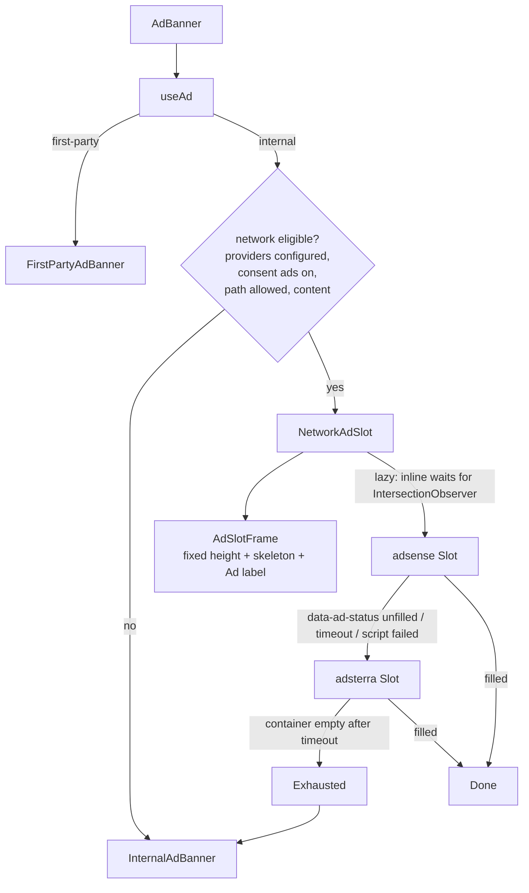

# Web display ads Implementation Plan

> **For agentic workers:** REQUIRED SUB-SKILL: Use superpowers:subagent-driven-development (recommended) or superpowers:executing-plans to implement this plan task-by-task. Steps use checkbox (`- [ ]`) syntax for tracking.

**Goal:** Monetize `app.saomiguelhub.com` with third-party display ads behind a provider waterfall (first-party campaign → network providers in env order → house creative), gated by the existing consent banner and premium status, shipping a network that accepts the site today and making AdSense a one-line config switch once approved.

**Architecture:** A `WebAdProvider` interface under `src/features/ads/providers/` wraps each network (`adsense`, `adsterra`, plus `mock` and `none` for dev/tests). `AdBanner` keeps its first-party → internal decision but, when the internal tier is reached and network providers are configured and consented, it first renders a `NetworkAdSlot` that walks the provider list and only falls back to the house creative when every provider reports unfilled, blocked or timed out. A fixed-height `AdSlotFrame` (measured once with `useLayoutEffect`) reserves space so the swap never shifts content.

**Tech Stack:** React 19, Vite 8 (static `import.meta.env.VITE_*` reads only), zustand consent store, vitest 4 (`node` env by default, `// @vitest-environment jsdom` for component tests), Tailwind v4 plus a few plain CSS rules for breakpoint heights.

**Spec:** `docs/handover/2026-09-05-web-ads-adsense-fallback-handover.md` (the handover is the spec; this plan argues from it).

## Global Constraints

- No network script may be injected before the consent store reports `decided === true` and `purposes.ads === true`. Premium users (`useCanShowAds() === false`) never load a network script.
- `import.meta.env.VITE_*` must be read with static property access (Vite string-replaces them at build time; dynamic access is `undefined` in release builds).
- All ad code must be inert without a DOM: guard on `typeof window === 'undefined'` / `typeof document === 'undefined'` so `vite-plugin-seo.ts` prerendering and vitest `node` tests never touch a network.
- Do not touch `legacy/` except to read it.
- The "Ad" label (`t('transitAdLabel')`) stays on every slot. No custom click handlers wrapped around network units.
- Analytics events go through `track('transit', '<event>', props)` with literal event strings (the parity test greps for literals).
- `npm run lint`, `npm test` and `npm run build` must pass at the end of every task.

---

## Summary

Web is 42 % of route searches but earned nothing from 66,628 house creatives in the last 30 days. AdSense approval for an app-like SPA on a new domain is uncertain, so we ship a network that accepts the site now (Adsterra, Native Banner units only), build the provider abstraction so `VITE_WEB_AD_PROVIDERS=adsense,adsterra` becomes the production value after approval, and prepare every AdSense prerequisite (`ads.txt`, consent mode, privacy copy, crawlable content follow-up) in parallel.

## Phase 0 — Fallback network research

Research date 2026-09-05. Sources: each network's own site/help center, Google AdSense Help, the IAB Europe Global Vendor List v3 (`vendor-list.consensu.org`, list version 175, checked by script), plus publisher reviews for reputation.

### Comparison

| Network | Accepts us now? (new PT site, ~9k loads/mo, no AdSense) | GDPR / TCF | Formats we would use | SPA integration | Payout (Portugal) | Reputation / EU demand | Verdict |
|---|---|---|---|---|---|---|---|
| **Adsterra** | Yes. No traffic minimum, automated + manual review in 10 min to 72 h. | Not on the TCF GVL. No non-personalized mode documented. Publisher must show a privacy policy and gate loading on consent; we only load it when the `ads` purpose is on. | Banner (fixed sizes) and **Native Banner** (container div + async `invoke.js`). We use Native Banner only. Popunder/Social Bar/In-Page Push exist but are never placed. | Per-unit script. Banner format uses a global `atOptions`, so multiple units need iframe isolation; Native Banner fills `#container-<key>`. We render each unit in a same-origin `srcdoc` iframe, which fixes both. No unfilled callback: detect via container children / timeout. | PayPal (min ≈ $25), Paxum ($5), wire ($1,000), local bank transfer via Hyperwallet. NET15, twice a month. USD. | Large network, plenty of EU/PT fill. Mixed reputation: reports of scareware-style creatives in banners; official anti-malvertising program. Mitigate with category blocks in the dashboard and our kill switch (remove from `VITE_WEB_AD_PROVIDERS`, redeploy). | **Recommended fallback.** |
| **Adcash** (Tallinn, EU) | Yes. No stated minimum; manual review, recent reports of "content rejected" for small sites. | Not on the TCF GVL. No NPA mode documented. | Display banners and native via `aclib.js` + `aclib.runBanner({ zoneId })`. | One library load, one call per zone. Cleaner than Adsterra, but the official docs are JS-rendered and I could not confirm the render-target semantics from a primary source. | PayPal/Skrill/Revolut/USDC ($5), wire ($100). EUR available. NET+1 to NET+30, weekly to monthly. | Mixed: a June 2026 review reports adult creatives despite opt-out. Anti-fraud engine. | **Runner-up.** Drop-in as a second provider file if Adsterra quality disappoints. |
| **Ezoic** | No. Sites added after 19 Feb 2026 need 250k monthly visits. | TCF vendor 347. | Display, in-content. | Auto-inserted. | — | Fine. | Reject (traffic). |
| **Media.net** | No. English-first content, tier-1 traffic (US/UK/CA) expected. | TCF vendor 142. | Contextual display. | Script tag. | $100 threshold. | Fine. | Reject (language/geo). |
| **Journey by Mediavine** | Unlikely. 1,000 sessions/30 days from premium geos, tracked by the Grow script for 30 days first; Portuguese traffic is not "premium". | TCF vendor 858. | Auto-inserted display. | Auto-inserted, little slot control. | Net 65, 70 % share. | Excellent. | Reject for now; re-evaluate if tourist (US/UK) traffic grows. |
| **Monumetric** | No. 10k pageviews, WordPress/Blogger only, 50 % English-speaking traffic, $99 setup fee. | — | Display. | — | — | Fine. | Reject. |
| **Monetag / PropellerAds** | Yes (no minimum). | Not TCF. | Only Popunder, Push, In-Page Push, Interstitial, Vignette (overlay). No classic display. | MultiTag auto-inserts. | $5. | Aggressive formats. | Reject (formats). |
| **A-ADS** | Yes, no approval. | Cookie-free, so no consent needed for its own tag. | Banners, but advertisers are almost exclusively crypto/gambling. | Static iframe. | Bitcoin only. | Not brand-safe for a public transit app. | Reject (creative quality, BTC payout). |
| **Infolinks** | Yes, no minimum. | TCF vendor 1136. | InText/InFold/InScreen/InArticle: hover, overlay and interstitial units injected into text. | Auto-injected. | $50 PayPal, net 45. | Intrusive. | Reject (formats). |
| **Sovrn** | Formally no minimum, manual review; but the product is header bidding (Prebid + an ad server), no simple ad tag for small sites. | TCF vendor 13. | Display via Prebid. | Needs Prebid/GAM stack. | — | Good EU demand. | Reject for v1 (integration weight). Interesting once AdSense/GAM exists. |
| **Setupad** | No. 100k visitors/month, ≈ €500/month revenue suggested. | TCF vendor 1241. | Header bidding. | — | — | Good. | Reject (traffic). |
| **Publift** | No. 500k pageviews or $2k/month. | — | — | — | — | Good. | Reject (traffic). |
| **Google Ad Manager** | Only after AdSense approval (needs an approved AdSense account to back-fill). | Google CMP. | Everything. | GPT. | Via AdSense. | — | Later. |
| **nuwara.io** (Nuwara Labs, Bratislava) | Contact-sales only, no self-serve; not on the GVL. The `legacy/ads.txt` lines (`nuwara.io, 23213548796, DIRECT`, added Nov 2024) show a past engagement but no script was ever integrated in `legacy/`. | Unknown. | Managed stack incl. content lockers/rewarded. | Managed. | Unknown. | Unknown. | Human check only: search the inbox for a Nuwara account before deciding whether to re-engage. Not a code target. |
| **Direct-sold (first-party `Ad` model)** | Always. | Our own consent (no third-party cookies). | House creative "Anuncie aqui" selling the slot to local businesses. | Already implemented. | Invoice. | — | Stays as tier 1 (first-party campaign) and as the terminal house tier. |

### Recommendation

Ship **Adsterra, Native Banner format only**, as the fallback provider. It is the only candidate that (a) accepts the site immediately without traffic or AdSense prerequisites, (b) offers a controlled placement format we render into our own container, (c) has a well-documented tag, and (d) pays via PayPal or local bank transfer in Portugal at a low threshold. Its weakness is creative quality; we mitigate it by using only Native Banner units, blocking sensitive categories in the dashboard, tracking `ad_network_click` per slot, and keeping a one-line kill switch. Adcash is the runner-up and the provider interface makes it a single-file addition.

Because neither network is an IAB TCF vendor, there is no consent string to pass. Their scripts load only when the user has accepted the `ads` purpose. When the purpose is rejected, the slot goes straight to the house creative.

### Human steps for Adsterra (needed before real fill; the code ships with placeholders and a `mock` provider)

> **Status 2026-09-05:** account created and `app.saomiguelhub.com` submitted for review. One Native
> Banner placement exists (`…/5fbee8732f91268c27456a638205eeee/invoke.js` on
> `pl31201609.profitableratecpmnetwork.com`); it is the Dockerfile default for both `top` and
> `inline`. Steps 3 (a separate `inline` placement, for per-position reporting), 5 and 6 are still open.
> AdSense stays out of `VITE_WEB_AD_PROVIDERS` until the Adsterra review has passed.

1. Create a publisher account at `https://publishers.adsterra.com` (payment details: PayPal or bank transfer via Hyperwallet). Approval is usually under 72 h.
2. Add website `app.saomiguelhub.com`. Category: Travel / Transportation. Enable **only** the Native Banner format.
3. Create two Native Banner placements: `top` (layout 1×1 or 2×1, horizontal) and `inline` (same layout). Optional: `sidebar`, `footer`.
4. For each placement copy the script `src` (looks like `//pl1234567.profitablecpmrate.com/<32-hex-key>/invoke.js`) and set:
   - `VITE_ADSTERRA_NATIVE_TOP=https://pl1234567.profitablecpmrate.com/<key-top>/invoke.js`
   - `VITE_ADSTERRA_NATIVE_INLINE=https://pl1234567.profitablecpmrate.com/<key-inline>/invoke.js`
5. In the dashboard block categories: adult, gambling, dating, software downloads, "scare" creatives (use the exclusion list).
6. Copy the `ads.txt` lines Adsterra shows under the website settings into `public/ads.txt` and into the root-domain `ads.txt` (see Phase 2).
7. Set `VITE_WEB_AD_PROVIDERS=adsterra` in Dokploy build args and redeploy.

## Requirements (from the handover)

| ID | Requirement |
|----|-------------|
| R1 | `src/features/ads/providers/` with a `WebAdProvider` interface (`id`, `load(consent)`, slot component with `on`/`slot`/`placement`, `onFilled`/`onUnfilled`, `teardown()`); implementations `adsense`, `adsterra`, `none` (+ `mock`). |
| R2 | Ordered provider waterfall from `VITE_WEB_AD_PROVIDERS`, per-provider IDs in env, documented in README and `.env.example` (and passed through the Dockerfile build args). |
| R3 | Per-slot waterfall first-party → networks in order → house; AdSense `data-ad-status="unfilled"` advances; blocked/failed script counts as unfilled. |
| R4 | No script before `decided`; `ads` off → skip network tier; `personalization` off → AdSense non-personalized; CMP decision documented. |
| R5 | Reserved heights per breakpoint, skeleton, IntersectionObserver lazy-load for inline slots, script loaded once across routes. |
| R6 | No network ads on consent-undecided, privacy, terms, not-found, empty or loading states; "Ad" label kept; no click wrappers; one `top` slot on hub, weather, news, earthquakes, traffic, trails, tours, stop and line pages; no network interstitials. |
| R7 | `public/ads.txt` plus the root-domain note and exact human steps. |
| R8 | `transit` / `ad_network_request`, `ad_network_filled`, `ad_network_unfilled`, `ad_network_click` with `provider`, `on`, `slot`, `placement`; added to the parity checklist. |
| R9 | Vitest coverage for env parsing, consent gating, NPA mode, waterfall advance on unfilled and on script failure, lazy gating, premium suppression; lint/test/build green; prerender unaffected. |

## Key Technical Decisions

1. **Network tier sits inside the existing `internal` branch of `useAd`.** `resolveAdSlotKind` is untouched: first-party campaigns keep priority and their API impression/click recording. When the kind is `internal`, `AdBanner` renders `NetworkAdSlot` first and only renders `InternalAdBanner` once the slot reports exhausted. Rationale: no change to the first-party tier; house stays the terminal fallback.
2. **Consent mode is a pure function** `resolveNetworkConsentMode({ decided, purposes })` → `'blocked' | 'non-personalized' | 'personalized'`. `ads` off (or undecided) blocks all network providers. `personalization` off maps to AdSense `requestNonPersonalizedAds = 1`. Adsterra has no NPA mode, so it runs only when `ads` is on. Rationale: matches the existing purpose semantics ("Ads" = allow third-party advertising, "Personalization" = allow profiling).
3. **CMP decision for AdSense in the EEA.** Google requires a Google-certified TCF CMP for personalized ads in the EEA; without one only limited/non-personalized serving is possible and even NPA still needs cookie consent. Decision: when AdSense is enabled, turn on **Google's own European regulations message** (AdSense → Privacy & messaging, free, TCF v2.3 certified, no Ad Manager needed). It is delivered by `adsbygoogle.js` itself and only appears once our banner has allowed the `ads` purpose and the script loads, so the two banners never show together: ours governs analytics/personalization and whether Google runs at all, Google's collects the TCF string for its vendors. Third-party certified CMPs (CookieYes, Usercentrics) cost money and duplicate our banner; reject for now.
4. **Adsterra units render inside a same-origin `srcdoc` iframe.** Adsterra's tags use a page-global (`atOptions`) and a fixed container id, so two units of the same placement on one page collide. A `srcdoc` iframe gives each unit its own `window`/`document`, isolates their CSS from ours, and lets us observe fill from the parent (same origin). Fill = container gains a child before a timeout; anything else = unfilled.
5. **Fixed-height frame measured once.** `AdSlotFrame` measures its width in `useLayoutEffect` (before paint), picks the largest standard horizontal size that fits (728×90, 468×60, 320×100, 320×50) and reserves the max height across the eligible providers (Adsterra native = 120 px). The house creative renders inside the same frame when a network tier exists, so the swap is shift-free.
6. **Provider blocked registry.** A failed script load marks the provider blocked for the session (`markProviderBlocked(id)`); subsequent slots skip it synchronously. Ad-blocker users therefore see the house creative with no wait.
7. **Clicks on cross-origin iframes are inferred, not intercepted.** `useFrameClickHeuristic` fires `ad_network_click` when the window loses focus while the pointer is over the frame. No handler is attached to the ad itself, respecting the "no click wrappers" rule; the number is approximate and documented as such.
8. **Static env object.** `getWebAdConfig()` builds one object with static `import.meta.env.VITE_…` reads and passes it to pure parsers so tests can inject envs.

## High-Level Technical Design



## File structure

```
src/features/ads/providers/
  types.ts                 WebAdProvider, NetworkSlotProps, AdPlacement, ids
  config.ts                parseProviderList, readWebAdConfig, getWebAdConfig (static env)
  consent-mode.ts          resolveNetworkConsentMode + useNetworkConsentMode hook
  script-loader.ts         loadScriptOnce(src, attrs) → 'ready' | 'blocked', test reset
  blocked.ts               markProviderBlocked / isProviderBlocked / reset
  frame-size.ts            pickHorizontalSize(width) → {width,height}
  network-analytics.ts     trackNetworkAd(event, props) with literal track() calls
  registry.ts              getNetworkProviders(config) → ordered provider instances
  adsense.tsx              AdSense provider (script once, NPA flag, <ins>, data-ad-status observer)
  adsterra.tsx             Adsterra provider (srcdoc iframe, container fill observer)
  mock.tsx                 mock provider (placeholder, fills or unfills by env)
  none.ts                  none provider (never loads, unfilled immediately)
src/features/ads/lib/placement-policy.ts   isNetworkAdAllowedOnPath, resolvePlacement(slot)
src/features/ads/hooks/useNearViewport.ts  IntersectionObserver gate
src/features/ads/hooks/useFrameClickHeuristic.ts
src/features/ads/components/AdSlotFrame.tsx
src/features/ads/components/NetworkAdSlot.tsx
src/features/ads/components/AdBanner.tsx   (modified: network tier, placement, content prop)
src/index.css                              (.ad-frame styles)
src/lib/analytics-parity.ts                (+4 events)
public/ads.txt
.env.example, README.md, Dockerfile        (env docs + build args)
test/features/ads/providers/*.test.ts(x), test/features/ads/ads-txt.test.ts, test/features/ads/placement-policy.test.ts
```

## Implementation tasks

Each task: write the failing test, run `npx vitest run <file>` and see it fail, implement, run again, then `npm run lint`, and commit.

### Task 1: Provider types and env config

**Files:** create `src/features/ads/providers/types.ts`, `src/features/ads/providers/config.ts`; test `test/features/ads/providers/config.test.ts`.

**Produces:**
```ts
export type AdPlacement = 'top' | 'inline' | 'sidebar' | 'footer';
export type NetworkProviderId = 'adsense' | 'adsterra' | 'mock' | 'none';
export type UnfilledReason = 'unfilled' | 'script-failed' | 'timeout' | 'not-configured';
export type NetworkConsentMode = 'blocked' | 'non-personalized' | 'personalized';
export type ActiveConsentMode = Exclude<NetworkConsentMode, 'blocked'>;
export interface NetworkSlotProps { on: string; slot: string; placement: AdPlacement; consentMode: ActiveConsentMode; size: { width: number; height: number }; onFilled: () => void; onUnfilled: (reason: UnfilledReason) => void; }
export interface WebAdProvider { id: NetworkProviderId; supportsNonPersonalized: boolean; isConfigured(placement: AdPlacement): boolean; frameHeight(size): number; load(mode: ActiveConsentMode): Promise<'ready' | 'blocked'>; Slot: ComponentType<NetworkSlotProps>; teardown(): void; }
export interface WebAdEnv { VITE_WEB_AD_PROVIDERS?: string; VITE_ADSENSE_CLIENT?: string; VITE_ADSENSE_SLOT_TOP?: string; VITE_ADSENSE_SLOT_INLINE?: string; VITE_ADSENSE_SLOT_SIDEBAR?: string; VITE_ADSENSE_SLOT_FOOTER?: string; VITE_ADSENSE_TEST?: string; VITE_ADSTERRA_NATIVE_TOP?: string; VITE_ADSTERRA_NATIVE_INLINE?: string; VITE_ADSTERRA_NATIVE_SIDEBAR?: string; VITE_ADSTERRA_NATIVE_FOOTER?: string; VITE_ADSTERRA_FRAME_HEIGHT?: string; VITE_WEB_AD_MOCK_RESULT?: string; DEV?: boolean; }
export interface WebAdConfig { providers: NetworkProviderId[]; adsense: { client: string | null; slots: Record<AdPlacement, string | null>; test: boolean }; adsterra: { invoke: Record<AdPlacement, string | null>; frameHeight: number }; mock: { result: 'filled' | 'unfilled' }; }
export function parseProviderList(raw: string | undefined): NetworkProviderId[];
export function readWebAdConfig(env: WebAdEnv): WebAdConfig;
export function getWebAdConfig(): WebAdConfig; // memoized, static import.meta.env reads
export function resetWebAdConfigForTests(): void;
```

Tests: empty/undefined → `[]`; `"adsterra,house"` → `['adsterra']` (house implicit); `" adsense , adsterra ,adsense"` → deduped order; unknown ids dropped; `sidebar`/`footer` fall back to the inline id; `test` true when `VITE_ADSENSE_TEST=on` or `DEV` and not explicitly `off`; adsterra `frameHeight` default 120.

### Task 2: Consent mode, blocked registry, frame size, analytics helper

**Files:** create `consent-mode.ts`, `blocked.ts`, `frame-size.ts`, `network-analytics.ts`; tests `consent-mode.test.ts`, `frame-size.test.ts`, `blocked.test.ts`.

- `resolveNetworkConsentMode({ decided:false })` → `blocked`; `ads:false` → `blocked`; `ads:true, personalization:false` → `non-personalized`; both true → `personalized`.
- `pickHorizontalSize(width)`: ≥728 → 728×90; ≥468 → 468×60; ≥320 → 320×100; else 320×50.
- `blocked.ts`: session `Set`, `markProviderBlocked`, `isProviderBlocked`, `resetBlockedProvidersForTests`.
- `trackNetworkAd(event, props)`: four literal `track('transit', 'ad_network_…')` calls (switch). Add the four entries to `src/lib/analytics-parity.ts` (source `features/ads/providers/network-analytics.ts`).

### Task 3: Script loader and placement policy

**Files:** `script-loader.ts` (jsdom test), `src/features/ads/lib/placement-policy.ts` (node test).

- `loadScriptOnce(src, { attrs })`: returns cached promise per `src`; appends `<script async>` to `document.head` with attrs; resolves `'ready'` on `load`, `'blocked'` on `error`; `'blocked'` without a document. `resetScriptLoaderForTests()` clears the cache. Test: no `<script>` in the document until called; second call returns the same promise and inserts nothing; dispatching `error` resolves `'blocked'`.
- `isNetworkAdAllowedOnPath(pathname)`: true for `/hub`, `/transit…`, `/minibus…`, `/news…`, `/weather…`, `/earthquakes…`, `/trails…`, `/tours…`, `/traffic…`, `/marketplace…`; false for `/`, `/privacy.html`, `/terms.html`, `/anything-else`.
- `resolvePlacement(slot)`: `'top'` → `top`; `inline-…` → `inline`; `sidebar` → `sidebar`; `footer` → `footer`; default `inline`.

### Task 4: `none` and `mock` providers + registry

**Files:** `none.ts`, `mock.tsx`, `registry.ts`; test `registry.test.tsx` (jsdom).

- `none`: `isConfigured` true, `load` → `'ready'`, `Slot` calls `onUnfilled('not-configured')` in an effect, renders `null`.
- `mock`: `Slot` renders a dashed box with text `Mock ad · {placement} · {width}×{height}` and calls `onFilled()` (or `onUnfilled('unfilled')` when config `mock.result === 'unfilled'`) in an effect.
- `getNetworkProviders(config)`: maps ids → instances in order; memoized per config object.

### Task 5: `useNearViewport` and `useFrameClickHeuristic`

**Files:** `src/features/ads/hooks/useNearViewport.ts`, `src/features/ads/hooks/useFrameClickHeuristic.ts`; test `useNearViewport.test.tsx` (jsdom, fake `IntersectionObserver`).

- `useNearViewport(ref, { enabled, rootMargin = '600px' })` → `boolean`; `enabled:false` → `true` immediately; without `IntersectionObserver` → `true`; otherwise `false` until the fake observer reports `isIntersecting`.
- `useFrameClickHeuristic(ref, onClick)`: pointer enter/leave + `touchstart` track hover; `window` `blur` while hovered → `onClick()` once until the next `pointerleave`.

### Task 6: `AdSlotFrame` and `NetworkAdSlot`

**Files:** `AdSlotFrame.tsx`, `NetworkAdSlot.tsx`, `src/index.css`; test `NetworkAdSlot.test.tsx` (jsdom, `react-dom/client` + `act`, uses `none`/`mock` providers).

- `AdSlotFrame({ height, children, label })`: `div.ad-frame` with inline `style={{ height }}`, the "Ad" badge, a `Skeleton` behind children.
- `NetworkAdSlot({ on, slot, placement, consentMode, providers, onExhausted })`:
  1. `ref` on the frame; `useLayoutEffect` measures `clientWidth` → `size`.
  2. `eligible = providers.filter(p => p.isConfigured(placement) && !isProviderBlocked(p.id) && (consentMode === 'personalized' || p.supportsNonPersonalized))`.
  3. `near = useNearViewport(ref, { enabled: placement === 'inline' })`.
  4. `index` state; current provider `eligible[index]`; when `near` and provider exists: `trackNetworkAd('ad_network_request')`, render `<provider.Slot …>`; `onFilled` → track filled, `status = 'filled'`; `onUnfilled(reason)` → track unfilled with `reason`, `reason === 'script-failed'` → `markProviderBlocked`, `index + 1`.
  5. `index >= eligible.length` → `onExhausted()`; renders the frame with skeleton until parent swaps in the house creative (parent renders `InternalAdBanner` inside the same frame height).
  6. Frame height = `Math.max(...eligible.map(p => p.frameHeight(size)))` (fallback `size.height`).
  Tests: with `[none]` → `onExhausted` called, `ad_network_unfilled` tracked (mock `track`); with `[none, mock]` → advances and fills; with `enabled` lazy and a non-intersecting observer → no request tracked until intersecting.

### Task 7: AdSense provider

**Files:** `adsense.tsx`; test `adsense.test.tsx` (jsdom).

- `load(mode)`: guard document; set `window.adsbygoogle = window.adsbygoogle || []`; `adsbygoogle.requestNonPersonalizedAds = mode === 'non-personalized' ? 1 : 0`; `loadScriptOnce('https://pagead2.googlesyndication.com/pagead/js/adsbygoogle.js?client=' + client, { crossorigin: 'anonymous' })`.
- `Slot`: renders `<ins className="adsbygoogle" style={{ display:'inline-block', width, height }} data-ad-client data-ad-slot data-adtest={test ? 'on' : undefined} />` (fresh element per mount, keyed by `on:slot`). Effect: `await load(mode)`; `'blocked'` → `onUnfilled('script-failed')`; else `MutationObserver` on `data-ad-status` (`filled` → `onFilled`, `unfilled`/`unfill-optimized` → `onUnfilled('unfilled')`), then `window.adsbygoogle.push({})`; 10 s timeout → `onUnfilled('timeout')`. Cleanup disconnects and clears the timer.
- Tests: `ins` attributes; `data-adtest` present when `test`; NPA flag 1 in non-personalized mode and 0 otherwise; `data-ad-status="unfilled"` set on the `ins` triggers `onUnfilled('unfilled')`; script `error` → `onUnfilled('script-failed')`.

### Task 8: Adsterra provider

**Files:** `adsterra.tsx`; test `adsterra.test.ts(x)` (jsdom).

- `adsterraKeyFromInvoke(url)` → 32-hex segment before `/invoke.js`; `adsterraContainerId(url)` → `container-<key>`; `buildAdsterraSrcdoc(url)` → minimal HTML (`<body style="margin:0">`, `<div id="container-<key>">`, `<script async data-cfasync="false" src="<url>">`).
- `watchContainerFill(doc, containerId, timeoutMs)` → `Promise<'filled' | 'timeout'>` (resolves `filled` when the container has an element child; `MutationObserver` + timeout).
- `Slot`: `<iframe title={t('transitAdLabel')} srcDoc=… style={{ width:'100%', height, border:0 }} />`; on iframe `load`, `watchContainerFill(iframe.contentDocument, id, 8000)` → `onFilled`/`onUnfilled('timeout')`; missing `contentDocument` → `onUnfilled('script-failed')`.
- `load()` → `'ready'` (per-unit script). `frameHeight` → `config.adsterra.frameHeight`. `supportsNonPersonalized = false`.
- Tests: key/container parsing; srcdoc contains container and script; `watchContainerFill` resolves `filled` when a child is appended and `timeout` otherwise.

### Task 9: Wire `AdBanner`, call sites, CSS

**Files:** modify `src/features/ads/components/AdBanner.tsx`, `src/features/transit/TransitPage.tsx:390,444`, hub/weather/news/earthquakes/traffic/trails/tours/StopDetail/Line pages; test `ad-banner.test.tsx` (jsdom).

- `AdBanner({ on, slot = 'top', placement = resolvePlacement(slot), content = true })`.
- Network eligibility = `providers.length > 0 && consentMode !== 'blocked' && content && isNetworkAdAllowedOnPath(location.pathname)` and `kind === 'internal'` and not `exhausted`.
- When eligible and not exhausted → `<NetworkAdSlot … onExhausted={() => setExhausted(true)} />`; when exhausted and providers exist → house inside `AdSlotFrame` of the same height; when no providers → today's `InternalAdBanner`.
- TransitPage: `top` gets `content={hasResults && !search.isFetching}`; inline slots unchanged (they only exist with results).
- Other pages: `<AdBanner on="<module>" slot="top" />` directly under `PageHeader` only when data is loaded and non-empty (hub: after the bus CTA card).
- Tests: premium → renders nothing (`usePremiumStore.setState({ isPremium: true, isLoading: false })`); consent undecided → house creative markup and no network request tracked; `content={false}` → house.

### Task 10: `ads.txt`, env docs, Dockerfile, README

**Files:** `public/ads.txt`, `.env.example`, `README.md`, `Dockerfile`; test `test/features/ads/ads-txt.test.ts`.

- `public/ads.txt` = `google.com, pub-8246676797736648, DIRECT, f08c47fec0942fa0` plus a comment line about the Adsterra lines.
- `.env.example`: a `--- Ads ---` block for every variable in `WebAdEnv`.
- `Dockerfile`: `ARG`/`ENV` for each new `VITE_` variable (Dokploy passes build args; without them the production bundle has no providers).
- README: env table rows and a "Display ads" section (waterfall, consent, verification steps).

### Task 11: Verification and PR

- `npm run lint && npm test && npm run build`; confirm `dist/ads.txt`, `dist/transit/index.html` exist and contain no `adsbygoogle`.
- `npm run dev` with `VITE_WEB_AD_PROVIDERS=mock` and confirm the mock fills `top` and `inline` frames; `VITE_WEB_AD_MOCK_RESULT=unfilled` shows the house creative inside the frame.
- Open a PR against `main` from `feat/web-display-ads` with the verification steps below.

## Phase 2 — AdSense readiness (human checklist)

1. **Account and site.** Sign in to AdSense for `pub-8246676797736648` (the AdMob publisher). Under *Sites*, check whether `saomiguelhub.com` is listed; the legacy site was probably `saomiguelbus.com`. Add `saomiguelhub.com` (AdSense manages sites at the root domain since 2023; `app.saomiguelhub.com` and the module subdomains inherit its status and need no separate entry). Verify by either the `<meta name="google-adsense-account" content="ca-pub-8246676797736648">` tag in the root site's `<head>` (repo `SaoMiguelHub-Tools/SaoMiguelHub-LandingPage/index.html`, GitHub Pages) or the `ads.txt` method below.
2. **ads.txt at the root domain.** AdSense reads `https://saomiguelhub.com/ads.txt`, not the subdomain. The root is the GitHub Pages landing site (`SaoMiguelHub-Tools/SaoMiguelHub-LandingPage`, deploy on push to `main`, `CNAME` = `saomiguelhub.com`). It already has `app-ads.txt`; add a sibling `ads.txt` with the same content as `public/ads.txt` here (Google line + Adsterra lines). Optional: add `subdomain=app.saomiguelhub.com` only if the subdomain ever needs different sellers.
3. **Consent.** In AdSense → *Privacy & messaging* → *European regulations*, create and publish the GDPR message (Google CMP, TCF v2.3). Keep our banner as the first gate (see Decision 3). Confirm in the AdSense "EU user consent" report that consent rates are non-zero after launch.
4. **Privacy policy** (`https://saomiguelhub.com/privacy.html`, section 2.5 / 5). Replace the sentence saying the app uses no third-party advertising cookies with:

   > **PT:** A versão web da app (app.saomiguelhub.com) pode mostrar anúncios de terceiros. Com o teu consentimento para a finalidade "Anúncios", carregamos scripts de redes publicitárias — atualmente Google AdSense (Google Ireland Ltd.) e Adsterra (Adsterra LLC) — que podem usar cookies e identificadores do dispositivo para medir impressões e cliques e, se também aceitares "Personalização", para mostrar anúncios personalizados. Sem esse consentimento mostramos apenas anúncios próprios, sem cookies de terceiros. Podes alterar a escolha a qualquer momento nas definições da app. Consulta as políticas de privacidade da Google (policies.google.com/technologies/ads) e da Adsterra (adsterra.com/privacy-policy). Os subscritores premium não veem anúncios.
   >
   > **EN:** The web version of the app (app.saomiguelhub.com) may show third-party ads. With your consent for the "Ads" purpose we load ad-network scripts — currently Google AdSense (Google Ireland Ltd.) and Adsterra (Adsterra LLC) — which may use cookies and device identifiers to measure impressions and clicks and, if you also accept "Personalization", to show personalized ads. Without that consent we only show our own house ads, with no third-party cookies. You can change your choice at any time in the app settings. See Google's (policies.google.com/technologies/ads) and Adsterra's (adsterra.com/privacy-policy) privacy policies. Premium subscribers see no ads.

5. **Content sufficiency (follow-up, out of scope here).** The prerender only emits meta tags. Before applying, prerender real text for the highest-value routes: `/transit/line/:code` (stop list and timetable), `/transit/stop/:stopId` (next departures), `/transit/prices`, `/transit/network`. These have stable server data and are what a reviewer and the crawler will judge. Track as a separate plan.
6. **Manual units, not Auto Ads.** Create two display ad units in AdSense: "Web top" and "Web inline" (responsive), copy the slot ids into `VITE_ADSENSE_SLOT_TOP` / `VITE_ADSENSE_SLOT_INLINE`, `VITE_ADSENSE_CLIENT=ca-pub-8246676797736648`. Non-production builds send `data-adtest="on"` automatically (`import.meta.env.DEV`); force with `VITE_ADSENSE_TEST=on|off`.
7. **Switch-over checklist.** After approval: set `VITE_WEB_AD_PROVIDERS=adsense,adsterra` in Dokploy build args, redeploy, load `https://app.saomiguelhub.com/ads.txt` and `https://saomiguelhub.com/ads.txt`, accept all in the consent banner and confirm Google's GDPR message appears once, reject the `ads` purpose and confirm only house creatives render, check `reports/overview?platform=web&event_type=ad_network_filled` and `…=ad_network_unfilled` after 24 h for fill rate per `slot` via `reports/properties`.

## Verification (for the PR description)

1. `npm run dev` with `VITE_WEB_AD_PROVIDERS=mock` → mock creatives render in the `top` and `inline` frames on `/transit` after a search, and in the `top` frame on `/hub`, `/weather`, `/news`, `/earthquakes`, `/traffic`, `/trails`, `/tours`, `/transit/stop/:id`, `/transit/line/:code`.
2. Reject the `ads` purpose in the consent banner → no network request events, house creatives only. Accept `ads` but not `personalization` → AdSense provider sets `requestNonPersonalizedAds = 1` (visible in the console: `window.adsbygoogle.requestNonPersonalizedAds`).
3. With `VITE_WEB_AD_PROVIDERS=adsterra` and a browser ad blocker (or DevTools request blocking on `profitablecpmrate.com`) → the frame shows the house creative after the timeout, no layout jump.
4. Lighthouse on `/transit` with results: CLS unchanged versus `main`.
5. `npm run lint && npm test && npm run build` green; `dist/transit/index.html` contains no `adsbygoogle`.
